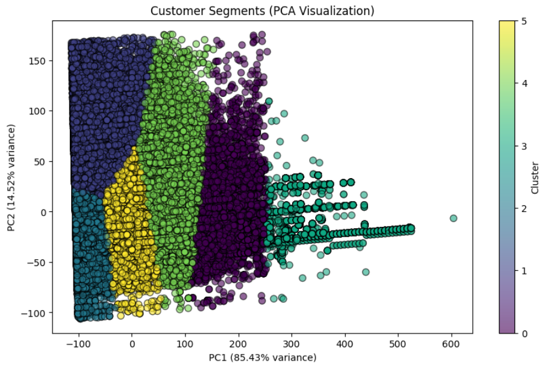
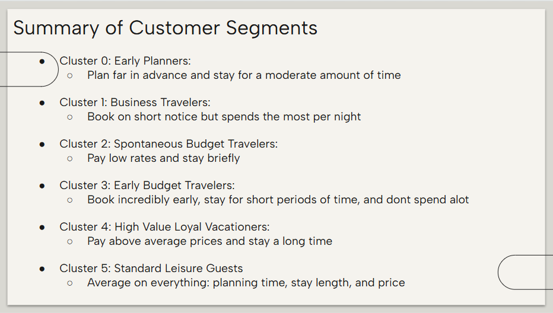

# Customer Segmentation for Marriott Hotel Bookings

## About
This was a group project completed during my MSBA program at UC Irvine. I collaborated with my team on the analysis and helped translate the clustering results into business insights and recommendations.

## Overview
This project segments Marriott’s online booking customers using clustering to better understand different booking behaviors and support targeted marketing and revenue strategies.

## Business Question
How can Marriott’s online booking customers be segmented based on factors like average amount spent, total guests, and region?

## Why This Matters
By understanding customer segments, Marriott can tailor digital experiences, personalize offers, and optimize revenue strategies for different groups of customers.

## Dataset
Marriott Mobile & Online Booking Dataset (Kaggle, synthetic)

Key features used:
- Lead time
- Length of stay
- Total guests
- Daily rate
- Season
- Region

## Methods
- Data cleaning + preprocessing
- Feature scaling for numeric variables
- Encoding categorical variables
- K-Means clustering (Elbow Method)
- PCA for visualization

## Results (Customer Segments)
6 segments were identified:
- Early Planners
- Business Travelers
- Spontaneous Budget Travelers
- Early Budget Travelers
- High Value Loyal Vacationers
- Standard Leisure Guests

## Key Visuals

### Customer Segments (PCA Visualization)

### Segment Summary

### Recommendations

## Recommendations
Segment-specific strategies such as:
- early-bird bundles for planners
- business perks for business travelers
- mobile-only promo rates for last-minute budget travelers
- loyalty upgrades for high-value long-stay guests

## Files
- `5B_Marketing_Analytics_Group_Project.ipynb` - full analysis
- `/slides/Marketing Analytics Project Presentation.pdf` - presentation deck

## Citation
Dataset: https://www.kaggle.com/datasets/jessemostipak/hotel-booking-demand

